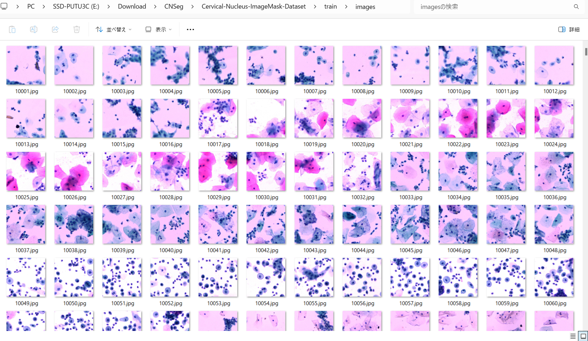
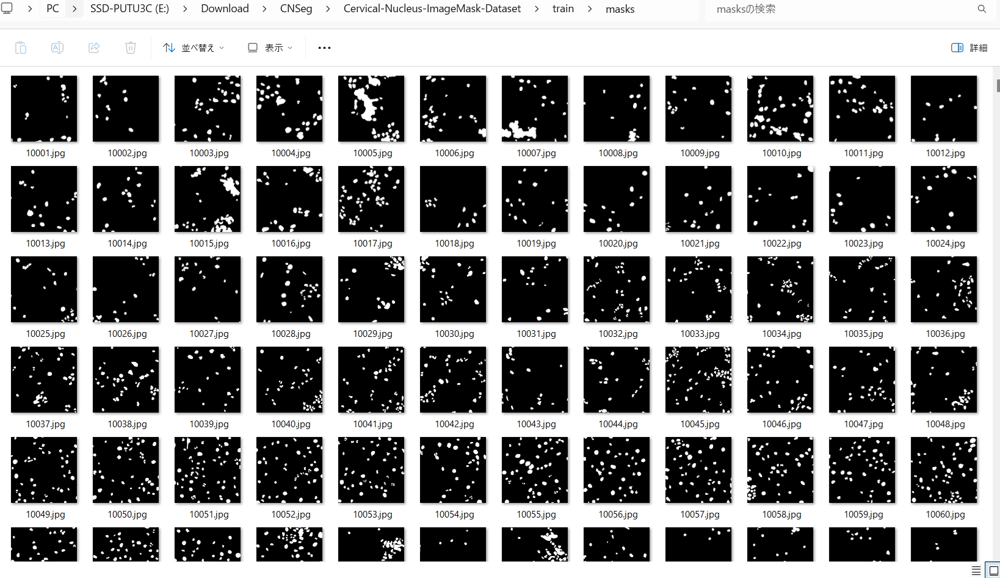
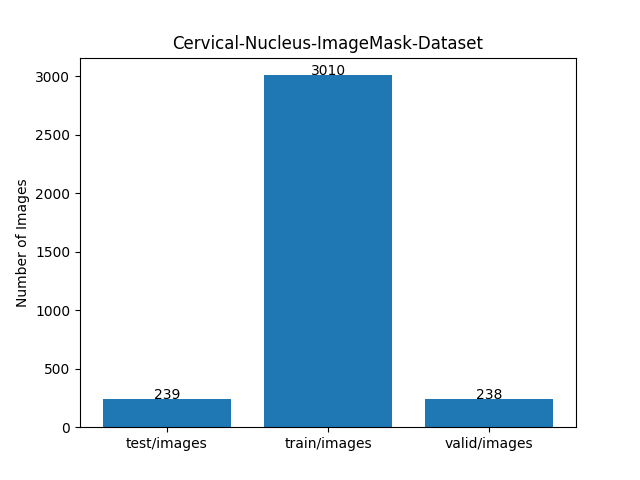

<h2>ImageMask-Dataset-Cervical-Nucleus (2024/08/30)</h2>

This is ImageMask Dataset for CNSeg (Cervical Nucleus Segmentation). 
The dataset used here has been taken from the following kaggle website: 
<a href="https://www.kaggle.com/datasets/zhaojing0522/cervical-nucleus-segmentation">
Cervical Nucleus Segmentation
</a>

 
 
<b>Download ImageMask-Dataset</b> 
You can download our dataset from the google drive 
<a href="https://drive.google.com/file/d/1Bv0MuqoBEJnWNxUz4gaAAYgNEIocsE9Q/view?usp=sharing">
Cervical-Nucleus-ImageMask-Dataset.zip</a>
 

<h3>1. Dataset Citation</h3>
<a href="https://dl.acm.org/doi/abs/10.1016/j.cmpb.2023.107732">
<b>CNSeg: : A dataset for cervical nuclear segmentation</b>
</a>
 

<b>Authors:</b> 
 Jing Zhao, Yong-jun He, Shu-Hang Zhou, Jian Qin, Yi-ning Xie 
 
@article{ZHAO2023107732, title = {CNSeg: A dataset for cervical nuclear segmentation},  
journal = {Computer Methods and Programs in Biomedicine}, volume = {241}, pages = {107732}, year = {2023}, issn = {0169-2607},  
doi = {https://doi.org/10.1016/j.cmpb.2023.107732},  
url = {https://www.sciencedirect.com/science/article/pii/S016926072300398X}, 
author = {Jing Zhao and Yong-jun He and Shu-Hang Zhou and Jian Qin and Yi-ning Xie} } 

 
Please see also:<a href="https://github.com/jingzhaohlj/AL-Net">https://github.com/jingzhaohlj/AL-Net</a> 

You can download CNSeg dataset from the kaggle website: 

 
<b>License</b>: Unknown  
 

<h3>2. ImageMaskDataset Generation</h3>
Please download the master CNSeg dataset from the kaggle web-site.  
<a href="https://www.kaggle.com/datasets/zhaojing0522/cervical-nucleus-segmentation">
Cervical Nucleus Segmentation
</a>
, and expand it in your working directory.
<pre>
./
├─clusteredCell
│  ├─difficult
│  ├─difficult_json
│  ├─normal
│  ├─normal_json
│  ├─sample
│  ├─sample_json
│  ├─test-difficult
│  ├─test-difficult_json
│  ├─test-normal
│  ├─test-normal_json
│  ├─test-sample
│  └─test-sample_json
├─PatchSeg
│  ├─test-images
│  ├─test-labels
│  ├─train-images
│  └─train-labels
├─TargetA
│  ├─test_images
│  ├─test_json
│  └─train_images
└─TargetB
    ├─test-images
    ├─test-labels
    └─train-images
</pre>

 
Please run the following command for Python script <a href="./ImageMaskDatasetGenerator.py">
ImageMaskDatasetGenerator.py</a>.
 

This command generates two types of datasets from the test and train datasets in PatchSeg. 
<pre>
./CNSeg-test-master
├─images
└─masks

./CNSeg-train-master
├─images
└─masks
</pre>

 
<h3>4. Split master</h3>

Pleser run the following command for Python <a href="./split_master.py">split_master.py</a> 
 
<pre>
>python split_master.py
</pre>
This creates Cervical-Nucleus-ImageMask-Dataset from CNSeg-test-master and CNSeg-train-master. 
<pre>
./Cervical-Nucleus-ImageMask-Dataset
├─test
│  ├─images
│  └─masks
├─train
│  ├─images
│  └─masks
└─valid
    ├─images
    └─masks
</pre>

Train images sample 
  
Train mask sample 
  

Dataset Statistics  
 
